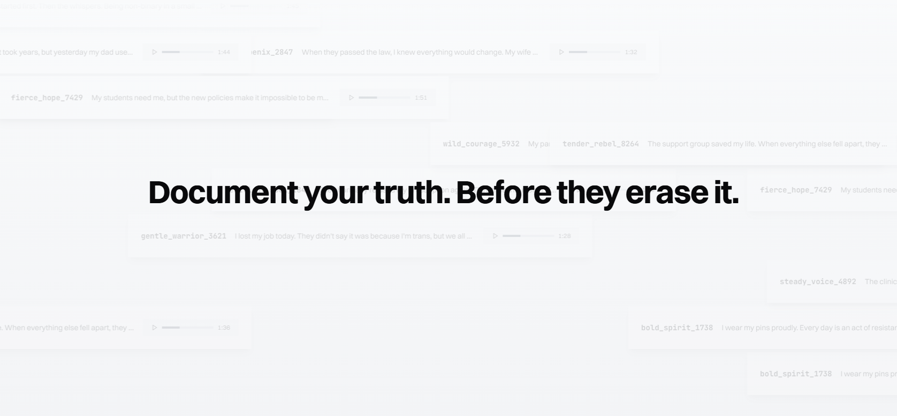

# Survival Pending - Monorepo

> A living, real-time archive of LGBTQ+ resilience in the United States.

<p align="center">
  
</p>

## 📁 Monorepo Structure

This is a Turborepo monorepo containing:

```
├── apps/
│   ├── web/          # Next.js web application
│   └── mobile/       # React Native mobile application
├── packages/
│   ├── ui/           # Shared UI components
│   ├── core/         # Core business logic and utilities
│   ├── database/     # Prisma schema and database client
│   └── config/       # Shared configuration files
```

## 🌈 About

**Survival Pending** is an urgent response to the retrenchment of LGBTQ+ rights and visibility in the United States. We provide a secure, anonymous platform for LGBTQ+ individuals to document their experiences, transforming written testimonies into powerful audio narratives using AI voice technology.

Every story shared becomes part of a permanent, uncensorable archive—a collective witness to both the challenges faced and the resilience shown by our community during these critical times.

### Why This Matters

- **Historical Record**: Personal stories become invaluable historical documentation
- **Community Connection**: Isolated individuals discover they're not alone
- **Safety Through Anonymity**: Share truth without risking personal safety
- **Amplified Voices**: AI audio transformation makes stories more accessible and impactful

## 🛡️ Privacy & Security First

Your safety is our absolute priority:

- **No Email Required**: Sign up with only a username and password
- **Anonymous Usernames**: Auto-generated in the format `adjective_noun_1234`
- **No Tracking**: Minimal analytics, no personal data collection
- **Quick Exit**: Press ESC 3 times or click the exit button to immediately leave
- **Encrypted Data**: All sensitive information is encrypted
- **Content Moderation**: AI pre-screening and human review ensure a safe space

## ✨ Key Features

### For Story Sharers
- **Write**: Share your experience in up to 1000 characters (~90 seconds of audio)
- **Refine**: Optional AI assistance to clarify your message while preserving your authentic voice
- **Voice Selection**: Choose from 8 diverse AI voices to represent your story
- **Preview**: Listen to your audio testimony before submitting
- **Crisis Support**: Immediate access to resources if you need help

### For Listeners
- **Browse Stories**: Filter by state, theme, or browse all approved stories
- **Audio Experience**: Every story is a unique audio testimony
- **Share Safely**: Built-in sharing tools that protect privacy
- **Community Insights**: See demographic patterns while maintaining individual anonymity

## 🚀 Getting Started

### Prerequisites

- Node.js 18+ and pnpm 9.15.1+
- PostgreSQL database (we recommend [Neon](https://neon.tech))
- Required API keys (see Environment Setup)

### Installation

1. **Clone the repository**
   ```bash
   git clone https://github.com/yourusername/survivalpending.git
   cd survivalpending
   ```

2. **Install dependencies**
   ```bash
   pnpm install
   ```

3. **Set up environment variables**
   
   For the web app, create `apps/web/.env.local`:
   ```env
   # Database
   DATABASE_URL="postgresql://..."
   
   # Authentication
   JWT_SECRET="generate-a-secure-secret"
   
   # AI Services
   ANTHROPIC_API_KEY="your-claude-api-key"
   GROQ_API_KEY="your-groq-api-key"
   ELEVENLABS_API_KEY="your-elevenlabs-key"
   
   # Security
   TURNSTILE_SECRET_KEY="your-cloudflare-turnstile-key"
   
   # Storage
   BLOB_READ_WRITE_TOKEN="your-vercel-blob-token"
   
   # Content Management (Optional)
   NEXT_PUBLIC_SANITY_PROJECT_ID="your-project-id"
   NEXT_PUBLIC_SANITY_DATASET="production"
   SANITY_API_TOKEN="your-sanity-token"
   ```

   For the mobile app, create `apps/mobile/.env.local`:
   ```env
   EXPO_PUBLIC_API_URL="http://localhost:3000"
   ```

4. **Initialize the database**
   ```bash
   pnpm db:generate
   pnpm db:push
   ```

5. **Run the development server**
   ```bash
   # Run all apps
   pnpm dev
   
   # Run only web app
   pnpm dev --filter=web
   
   # Run only mobile app
   pnpm dev --filter=mobile
   ```

   - Web app: [http://localhost:3000](http://localhost:3000)
   - Mobile app: Follow Expo instructions in terminal

## 🏗️ Architecture

### Tech Stack

- **Framework**: Next.js 15 with App Router
- **Database**: PostgreSQL (Neon) with Prisma ORM
- **Authentication**: Custom JWT-based anonymous auth
- **UI Components**: shadcn/ui with Tailwind CSS
- **AI Integration**: 
  - Claude 3.5 Sonnet for story refinement
  - ElevenLabs for text-to-speech
  - Groq for username generation
- **Content Management**: Sanity CMS (optional)
- **Analytics**: Google Analytics 4 & Meta Pixel (privacy-preserving)
- **Deployment**: Optimized for Vercel

### Monorepo Commands

```bash
# Development
pnpm dev              # Run all apps
pnpm dev --filter=web # Run only web app
pnpm dev --filter=mobile # Run only mobile app

# Building
pnpm build            # Build all apps
pnpm build --filter=web # Build specific app

# Database
pnpm db:generate      # Generate Prisma client
pnpm db:push          # Push schema changes
pnpm db:migrate       # Run migrations

# Testing & Linting
pnpm test             # Run all tests
pnpm lint             # Lint all packages
pnpm type-check       # Type check all packages

# Clean
pnpm clean            # Clean all build artifacts
```

### Project Structure

```
survivalpending/
├── apps/
│   ├── web/                # Next.js web application
│   │   ├── app/           # App router pages
│   │   ├── components/    # Web-specific components
│   │   └── lib/           # Web-specific utilities
│   └── mobile/            # React Native mobile app
│       ├── src/           # Mobile app source
│       └── assets/        # Mobile assets
├── packages/
│   ├── ui/                # Shared UI components
│   ├── core/              # Business logic & utilities
│   ├── database/          # Prisma schema & client
│   └── config/            # Shared configurations
├── turbo.json             # Turborepo configuration
├── pnpm-workspace.yaml    # PNPM workspace config
└── package.json           # Root package.json
```

## 🤝 Contributing

We welcome contributions that align with our mission of protecting and amplifying LGBTQ+ voices. 

### How to Contribute

1. **Check existing issues** or create a new one describing your contribution
2. **Fork the repository** and create a feature branch
3. **Follow the code style** - we use TypeScript and follow the existing patterns
4. **Test thoroughly** - ensure all features work and consider edge cases
5. **Submit a PR** with a clear description of changes

### Priority Areas

- Accessibility improvements
- Additional language support
- Performance optimizations
- Security enhancements
- Documentation improvements

### Code of Conduct

This is a safe space. We expect all contributors to:
- Respect the sensitive nature of the project
- Prioritize user safety and privacy
- Be inclusive and welcoming
- Follow our community guidelines

## 📋 Deployment

### Web App (Vercel)

The web app is optimized for deployment on Vercel:

1. Connect your GitHub repository to Vercel
2. Set the root directory to `apps/web`
3. Configure environment variables
4. Deploy

### Mobile App

The mobile app can be built using Expo EAS:

```bash
cd apps/mobile
eas build --platform ios
eas build --platform android
```

## 🔒 Security Considerations

Given the sensitive nature of this platform:

- All stories undergo AI pre-screening for harmful content
- Manual moderation ensures community safety
- Rate limiting prevents abuse
- No personally identifiable information is collected
- Regular security audits and updates

### Reporting Security Issues

Please report security vulnerabilities to [security@survivalpending.com](mailto:security@survivalpending.com). Do not create public issues for security problems.

## 📊 Deployment

### Vercel Deployment (Recommended)

1. Fork this repository
2. Sign up for [Vercel](https://vercel.com)
3. Import your forked repository
4. Add all environment variables
5. Deploy

### Self-Hosting

See our [deployment guide](./docs/DEPLOYMENT_CHECKLIST.md) for detailed instructions on self-hosting.

## 🆘 Crisis Resources

If you or someone you know needs immediate support:

- **Trans Lifeline**: 877-565-8860
- **The Trevor Project**: 1-866-488-7386
- **PFLAG**: [pflag.org](https://pflag.org) - Support for LGBTQ+ people and families
- **GLAAD**: [glaad.org](https://glaad.org) - Media advocacy and resources

## 📄 License

This project is licensed under a **Modified MIT License with Attribution and Non-Commercial Restrictions**.

Key points:
- ✅ You can contribute to this project
- ✅ You can use for personal/educational purposes
- ✅ You can deploy your own instance for your community
- ❌ You cannot create commercial derivatives
- ❌ You cannot remove attribution
- ❌ You cannot use for harmful purposes

See [LICENSE](./LICENSE) for full details.

**Important**: Stories submitted to the platform remain the property of their anonymous authors.

## 🙏 Acknowledgments

Built with:
- Love, urgency, and hope for our community
- [Next.js](https://nextjs.org/) and [Vercel](https://vercel.com)
- [shadcn/ui](https://ui.shadcn.com/) for beautiful components
- [Anthropic](https://anthropic.com), [ElevenLabs](https://elevenlabs.io), and [Groq](https://groq.com) for AI services

Special thanks to all the brave individuals sharing their stories and everyone working to protect LGBTQ+ rights.

---

<p align="center">
  <strong>Your story matters. Your voice matters. You matter.</strong>
  <br><br>
  <a href="https://survivalpending.com">Visit Survival Pending</a> • 
  <a href="https://survivalpending.com/signup">Share Your Story</a> • 
  <a href="https://survivalpending.com/stories">Listen to Stories</a>
</p>